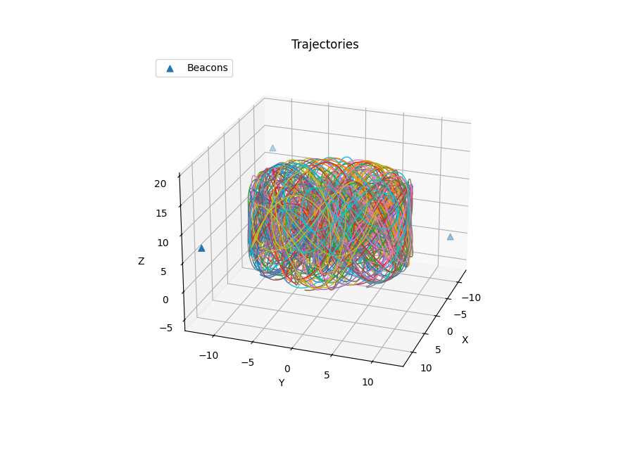
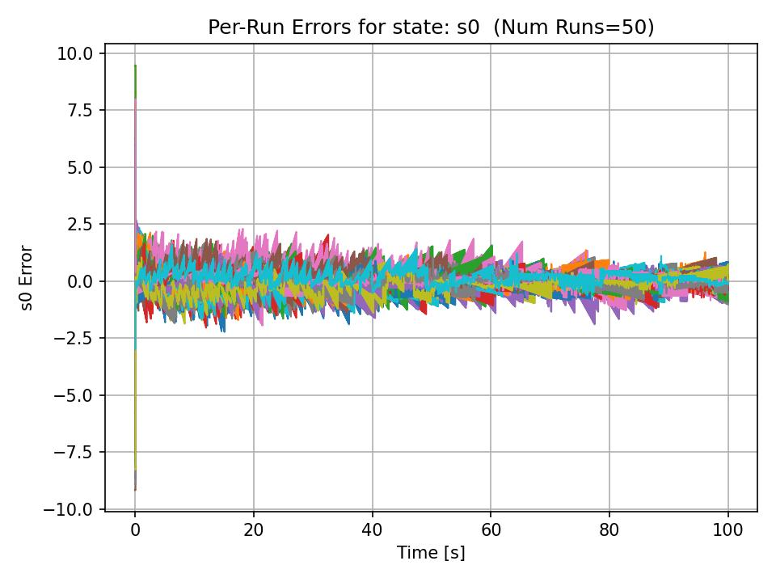
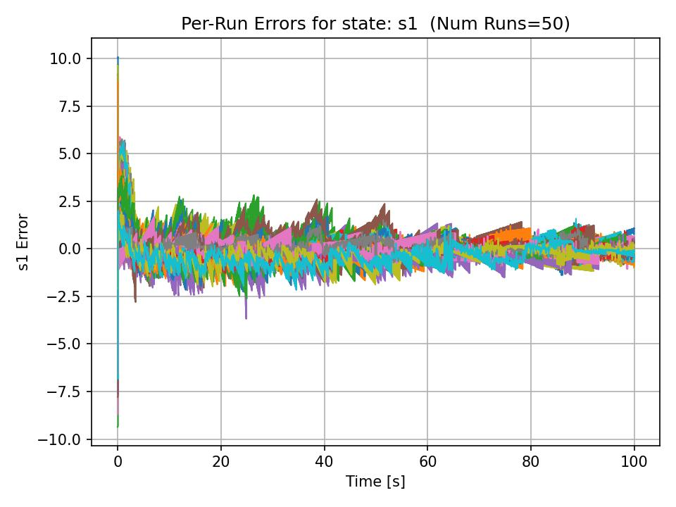
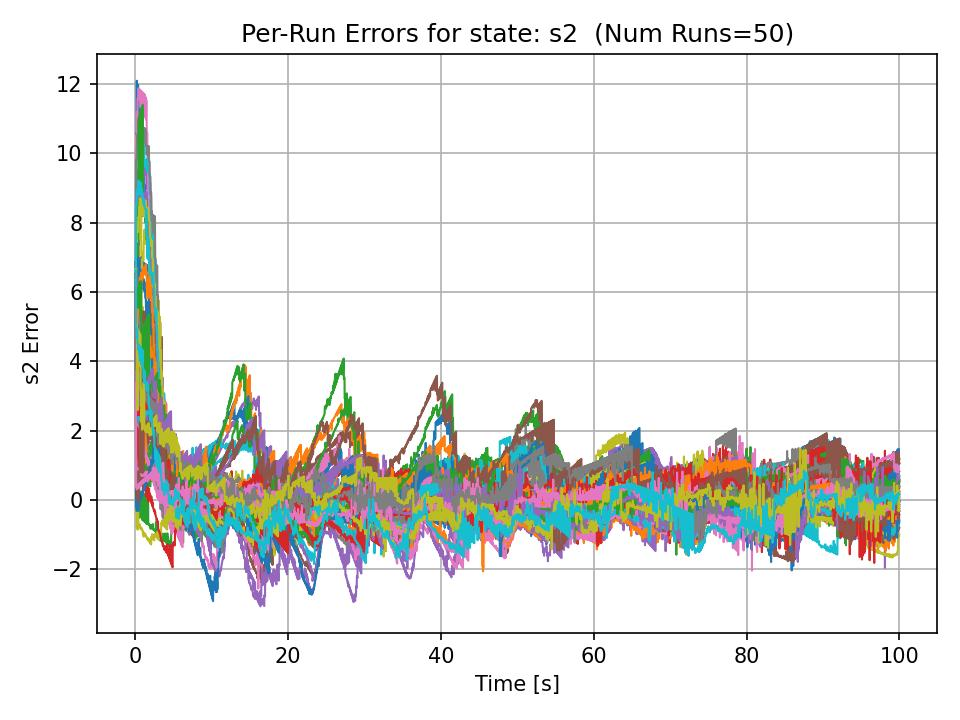

# Indoor Drone Particle Filter

This project was developed as a focused effort to **get up to speed with particle filters** and then **apply them to a practical indoor localization problem** that I have worked with in the past.

It builds on my previous work with extended Kalman filters for state estimation, such as in the **Mars Rover 3D Tracker** project (see: https://github.com/Ofredy/Mars-Rover-3D-Tracker), where an EKF was used to estimate rover position in 3D space. That experience with that problem helped inform the design and evaluation of the particle filter approach used here.

The core objective was to investigate whether a particle filter could be used to **reduce beacon dependency** for indoor drone state estimation by exploiting:
- known indoor geometry
- motion constraints
- and probabilistic state estimation

In particular, this work compares **three-beacon**, **two-beacon**, and **one-beacon** configurations, with the ultimate goal of determining how few beacons are required while still achieving reliable state convergence.

---

## Problem Setup & Motivation

Indoor localization is challenging due to:
- lack of GPS
- multipath effects
- constrained environments
- and limited sensing infrastructure

In this project, the drone is assumed to be operating inside a **known, bounded indoor space**, and beacon-based range measurements are used as observations. A particle filter is used to estimate the full state:

`x = [x, y, z, x_dot, y_dot, z_dot]`

The key question explored is:

> *Can a particle filter leverage geometry and motion constraints well enough to reduce the number of required beacons?*

---

## Three-Beacon Case (Baseline – Fully Observable)

The **three-beacon configuration** serves as the baseline case and the most observable setup.

With three beacons:
- the system is well constrained
- the particle filter converges quickly
- and all state components converge reliably

### Three-Beacon Case Results — Geometry & Position Convergence

The following trajectory plots illustrate the geometric constraints imposed by the three-beacon configuration and how the particle filter leverages this geometry to constrain and converge the state estimate.

#### Trajectory Visualization

---

### Position State Error

The plots below show the position estimation error along each axis over time using the three-beacon configuration.

#### X Position Error

#### Y Position Error

#### Z Position Error

These results demonstrate fast and stable convergence in all position states, validating the particle filter formulation and serving as a baseline for reduced-beacon experiments.

---

## Two-Beacon Case (Reduced Infrastructure – Primary Result)

The **two-beacon configuration** is the most important result of this project.

In this case:
- the system is **underdetermined geometrically** in a classical sense,
- but the particle filter is able to leverage:
  - motion continuity,
  - known indoor constraints,
  - and probabilistic weighting
to still converge.

### Key Observation

> Using a particle filter, the system **still converges with only two beacons**, albeit with **slower convergence** compared to the three-beacon case.

### Results

Results can be found at:

sim/
└── two_beacon_results/

Each simulation includes plots for:
- \(x, y, z\) position error
- \(\dot{x}, \dot{y}, \dot{z}\) velocity error

### Analysis

- Position and velocity states **do converge**
- Convergence time is longer than the three-beacon case
- Variance remains higher early in the simulation
- Once enough motion information accumulates, particles collapse correctly

This demonstrates that **particle filtering enables beacon reduction**, which is the primary success of this project.

---

## One-Beacon Case (Failed Attempt)

The **one-beacon configuration** was explored as an experimental extension.

Despite attempts to exploit:
- known indoor geometry,
- motion constraints,
- and probabilistic sampling,

the particle filter **did not reliably converge** with only one beacon.

### Attempted Approaches

- Exploiting known room geometry
- Constraining motion within bounds
- Experimental numerical PDF estimation using a **Firefly Particle Filter**
  - This approach was explored as a way to approximate the posterior more effectively
  - Results were inconsistent and did not outperform standard particle filtering

The Firefly-based implementation is preserved in the repository for potential future exploration.

### Insight

One possible path forward would be to:
- initialize the system from a **known state**
  - e.g., drone always starting on the floor,
  - directly in front of a beacon,
- and allow the filter to converge from that constrained prior.

However, this was not implemented in the current work.

---

## Simulation Weaknesses & Limitations

This project intentionally focuses on **filter behavior and geometry**, not full physical realism. As such, several limitations exist:

- ❌ No obstacle modeling within the indoor space
- ❌ No modeling of signal occlusion or wall reflections
- ❌ No signal attenuation or decay as a function of distance
- ❌ No multipath or non-line-of-sight effects
- ❌ Beacon signals are assumed ideal and balanced
- ❌ PDFs are not explicitly visualized (only state errors are shown)

These simplifications were made to isolate the behavior of the particle filter itself.

---

## Future Work

Several clear extensions naturally follow from this project:

- 📈 Visualizing full **PDF distributions** instead of only state errors
- 🧱 Modeling obstacles and indoor geometry explicitly
- 📡 Including signal attenuation and reflection effects
- 🔁 Improving robustness of the **one-beacon case**
- 🧠 Incorporating known initial conditions to reduce ambiguity
- ⚡ Performance optimization for real-time deployment

---

## Summary

This project demonstrates that:

- Particle filters are well-suited for indoor localization
- Geometry and motion constraints can be exploited probabilistically
- **Two beacons are sufficient** for convergence using a particle filter
- One beacon remains an open challenge under the current assumptions

Overall, this work served both as a **learning vehicle for particle filters** and as a **practical investigation into beacon-minimal indoor localization**.

---
